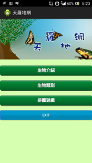
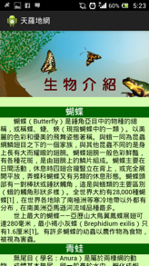
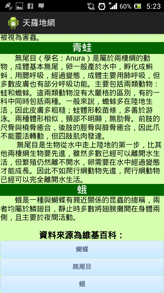
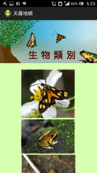
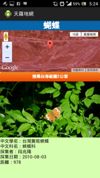
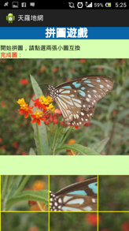

#APP名稱：天羅地網(愛生物創意加值應用競賽 - APP 第三名作品)

#說明：
這是在2013年參加行政院農業委員會特有生物保育中心所舉辦的「愛生物創意加值應用競賽」，參加的組別是APP，因為沒有限制是否要使用原生APP，在這邊使用的是WebView套網頁的方式。
這個APP是從我接觸APP製作第一個完整APP，只不過非Native APP，在這裡完整使用Web App的方式。

##APP簡介：
生態系中包含了多生物，如果我們要讓民眾更瞭解台灣的生態，藉以推動生態保育的觀念，則透過展示生態系中的各種生物資訊，可以讓民眾瞭解到生態系中需要多樣生物的交互作用才能永續發展。於是我們利用了特生中心的Open Data API中目前可以被使用的所有物種：青蛙、蝴蝶、蛾建構了此APP，讓使用者透過此系統能查詢到自己周遭以及自己所關心的地區這三類生物的分佈狀況，並能進一步深入瞭解到這些物種的習性和生態。 除了特生中心的API與資訊之外，天羅地網還利用連結同步去查詢維基百科與搜尋引擎的資料，把自己周遭的生物資訊與知識，用天羅地網、滴水不漏的方式調到使用者的手機上，讓使用者透過本App就可以迅速取得生物相關知識。 

##構想圖文說明
| APP畫面 | 說明 |  
| ---- | ----|  
|  | 進來的主程式畫面為封面，讓使用者更好理解畫面強調簡單易懂好上手使用，此畫面分為生物介紹、生物類別、拼圖遊戲。 |  
|   | 選入生物介紹，瞭解此系統要介紹的生物基本資料，方便使用者選擇生物類別。  引用： 維基百科-蝴蝶 (http://zh.wikipedia.org/wiki/%E8%9D%B4%E8%9D%B6) 維基百科-無尾目 (http://zh.wikipedia.org/wiki/%E9%9D%92%E8%9B%99) 維基百科-蛾 (http://zh.wikipedia.org/wiki/%E8%9B%BE)|  
|  | 生物類別可讓使用者選擇想查詢的生物，選入畫面分為三個圖可做選擇，選定就會進入生物搜尋系統，搜尋出該類別生物於使用者附近的分佈如何。 引用: 特有生物研究保育中心 (http://tesri.tesri.gov.tw/show_index.php)|  
|  | 生物搜尋是使用手機的GPS偵測目前位置，取得經緯度後，可以點擊地圖查詢有興趣的位置或是按鈕直接查詢目前使用者位置附近的生物資料。系統會查詢點擊處2公里範圍內的生物資訊，為了減少網路流量，系統只會回傳100筆以內的資料，並顯示該生物的相關資訊。 為了簡化使用者的操作，本系統提供手機向右或向左翻轉即可跳到下一筆或是上一筆生物資料的功能。 引用: 愛生物API (http://www.i35.club.tw/?q=api) |  
|  | 為提昇使用者的興趣，藉由遊戲讓使用者能與系統互動，我們運用查詢回來的圖形供使用者進行拼圖遊戲，透過這遊戲也能讓使用者更能體會生物所在的環境。  引用:  特有生物研究保育中心 (http://tesri.tesri.gov.tw/show_index.php)|  

##作品特色
以手機的GPS定位系統，讓使用者能隨時隨地的學習且瞭解到生物的多樣性，進而產生興趣，也藉由活動的方式，讓此系統除了學習，還能玩小遊戲，能讓這程式更多了趣味性。 不單針對單一物種，可查詢特生中心三種API，並分析處理不同的回傳資料。 提供手機翻轉切換資訊方式，讓使用者不用點選即可在查詢的資訊間切換。 除GPS查詢外，也提供地圖點選查詢，使用者不必到定點，也能查該地區的資訊，增加可用度。 小遊戲可運用查詢回來的圖形直接互動拼圖，增加使用者與生物知識之間的關係。
